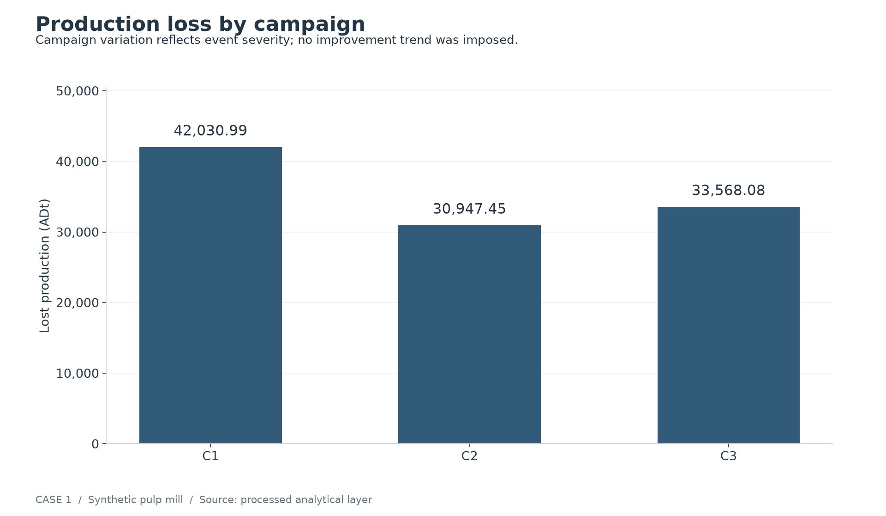
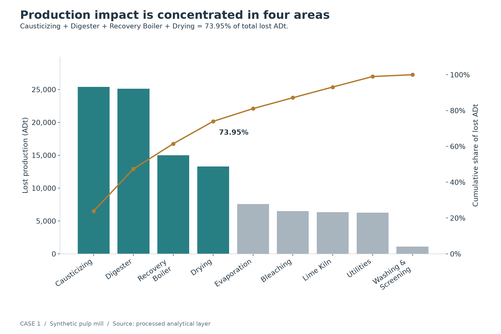
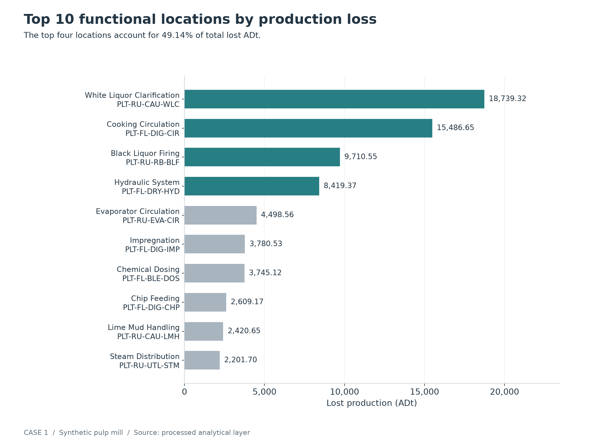
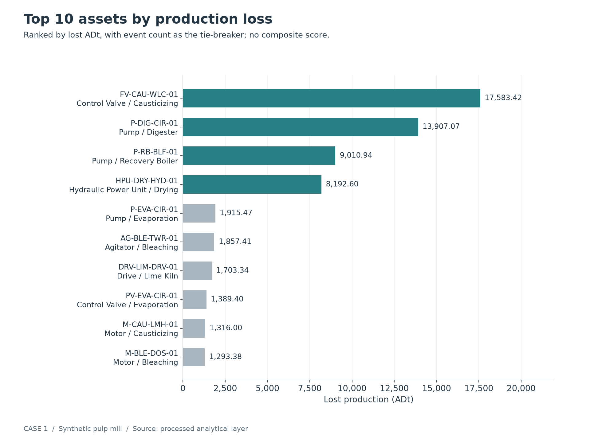
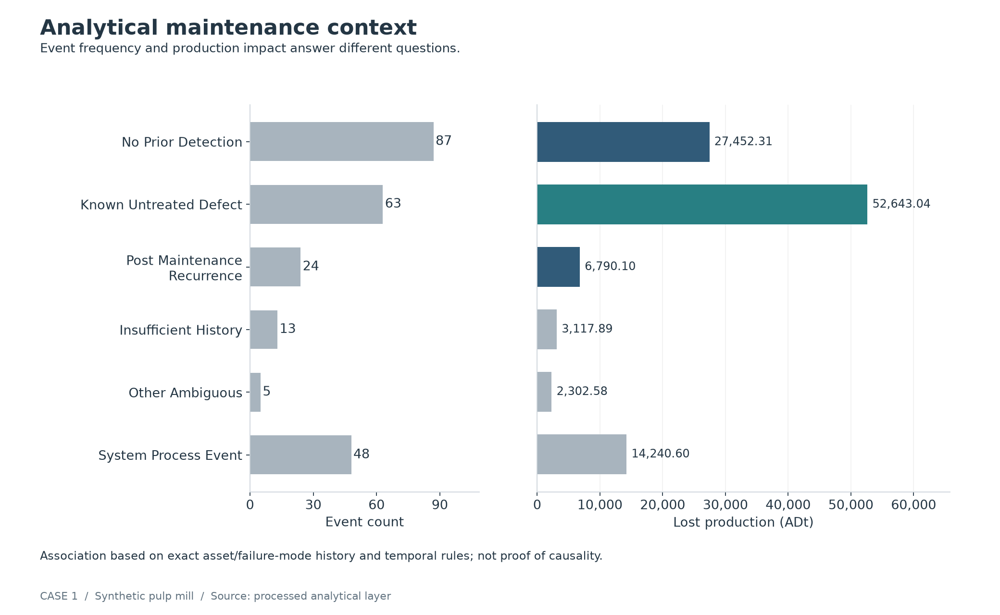
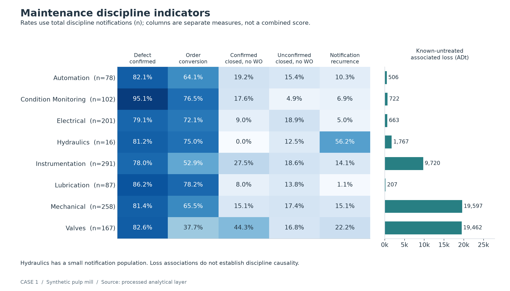
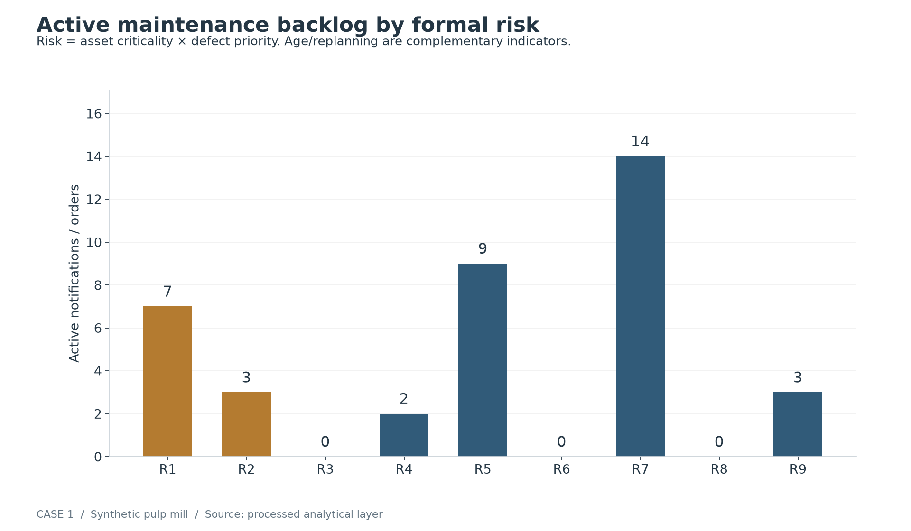
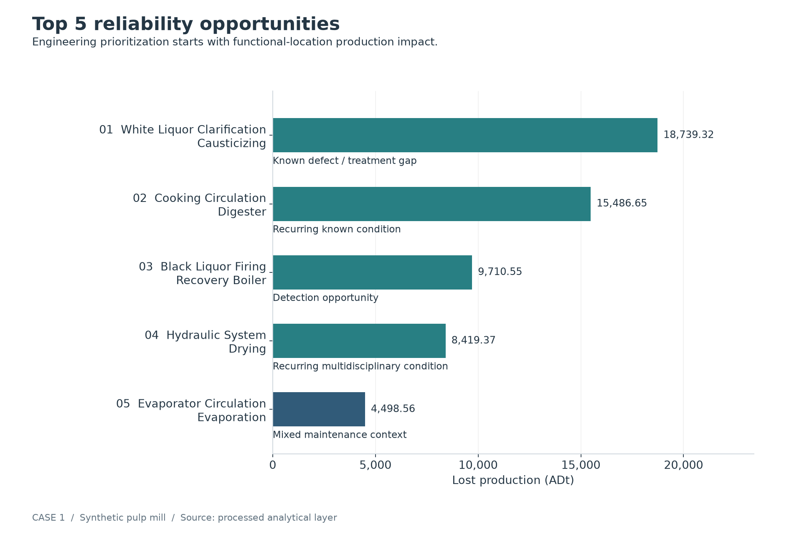

# Case 1 — Plant Production Loss & Bad Actor Analysis

## Executive Summary

This synthetic pulp-mill case covers **240 production-loss events**, **106,546.52 ADt** of lost production and **3 operating campaigns**. Causticizing, Digester, Recovery Boiler and Drying account for **73.95%** of loss. The top four functional locations account for **49.14%**.

Of **92,305.92 ADt attributed to specific assets**, **57.03%** is associated with known untreated defects, **29.74%** with no prior detection, and **7.36%** with recent completed corrective maintenance. These percentages are analytical maintenance-history associations, not causal attribution.

The scope is production-impact prioritization and management signals. Detailed Root Cause Analysis, FMEA and predictive modeling are reserved for subsequent work. All data is synthetic and does not describe an actual mill.

## 1. Production Loss Overview

| Campaign | Events | Lost ADt |
|---|---|---|
| C1 | 80 | 42,030.99 |
| C2 | 80 | 30,947.45 |
| C3 | 80 | 33,568.08 |

Event frequency is equal across campaigns, while lost production varies with interruption duration and rate reduction. The pattern does not demonstrate an improvement trend or a causal relationship with increased maintenance-notification activity.

## 2. Area Pareto

The leading four areas contribute 73.95% of lost ADt. This is production impact, not a ranking by event count. Smaller events in other areas remain visible; concentration directs attention without implying that every event in a priority area is severe.

## 3. System Prioritization

White Liquor Clarification, Cooking Circulation, Black Liquor Firing and the Drying Hydraulic System together represent 49.14% of total loss. Functional-location totals include system/process events without a specific asset attribution, providing a complete system-level Pareto.

## 4. Bad Actors

The leading assets are `FV-CAU-WLC-01`, `P-DIG-CIR-01`, `P-RB-BLF-01`, `HPU-DRY-HYD-01`. Their ranking is based on lost ADt; event count breaks ties. No composite score or assumed causal responsibility is used. Assets with maintenance activity but no loss remain in the analytical ranking with zero production impact.

## 5. Was the Defect Known?

| Analytical context | Events | Lost ADt |
|---|---|---|
| NO_PRIOR_DETECTION | 87 | 27,452.31 |
| KNOWN_UNTREATED_DEFECT | 63 | 52,643.04 |
| POST_MAINTENANCE_RECURRENCE | 24 | 6,790.10 |
| INSUFFICIENT_HISTORY | 13 | 3,117.89 |
| OTHER_AMBIGUOUS | 5 | 2,302.58 |
| SYSTEM_PROCESS_EVENT | 48 | 14,240.60 |

- **NO_PRIOR_DETECTION:** a detection/monitoring investigation opportunity; no confirmed exact asset/failure-mode notification was found in the prior 180-day window with sufficient history coverage.
- **KNOWN_UNTREATED_DEFECT:** a treatment, prioritization and maintenance-management investigation opportunity; a prior confirmed report exists without recorded meaningful correction after the latest relevant report and before impact.
- **POST_MAINTENANCE_RECURRENCE:** an intervention-effectiveness, diagnosis or recurrence investigation opportunity; meaningful correction was completed 7–120 days earlier without a newer confirmed matching report before impact.

These categories guide questions rather than establish causes. Same-day notifications are not proven prior detection because maintenance timestamps have calendar-date precision. Insufficient-history and ambiguous cases remain separate. Linked closure/action fields are snapshot attributes; their presence alone cannot establish when administrative disposition occurred. See the [processed-layer definitions](../data/processed/README.md).

## 6. Maintenance Discipline Indicators

- **Valves:** 37.72% conversion; 44.31% of notifications are confirmed defects closed without order, with 22.16% notification recurrence and 19,461.98 ADt of associated known-untreated loss. Review disposition and treatment chronology.
- **Hydraulics:** 56.25% recurrence across only 16 notifications. This supports focused review, not a broad conclusion about the discipline.
- **Electrical:** 72.14% conversion and 4.98% recurrence, alongside 18.91% unconfirmed closures without order. The latter raises a detection-quality question that requires checking the original observations.
- **Condition Monitoring:** 95.10% confirmed defects and 76.47% conversion. The positive comparator `FAN-RB-AIR-01` retains its completed early vibration intervention with 0 subsequent attributed production-loss events in the extract; this is not proof that all future failures were prevented.

Notification count is shown for every discipline. Chart rates use total discipline notifications as denominator. Notification recurrence is not itself recurrence after corrective work. Loss is associated once with the receiving discipline of the relevant notification; reassignment and ultimate technical ownership require a separate chronology review. The [full discipline matrix](../data/processed/discipline_performance.csv) preserves the detailed counts and rates. Route/team-level questions can be examined in [maintenance enrichment](../data/processed/maintenance_enriched.csv).

## 7. Current Risk Exposure

At the 2025-11-15 snapshot, active backlog contains **38 notifications/work items**, including **7 R1** and **3 R2** items. Risk comes directly from the existing criticality/priority matrix; age does not override it.

Recurring R1 work-order examples: FV-CAU-WLC-01: 45 days old, 5 replans; HPU-DRY-HYD-01: 45 days old, 5 replans; P-DIG-CIR-01: 45 days old, 5 replans. Age and replanning indicate items for review, not certainty of future failure. Inspect duplicate/related notifications and the current work scope before treating notification counts as distinct physical defects. The [risk backlog](../data/processed/risk_backlog.csv) retains formal ordering and identifiers.

## 8. Top 5 Reliability Opportunities

The table follows processed functional-location loss ranking. Main asset is the largest asset contributor within each location; main failure mode is that asset's largest lost-ADt mechanism. Signals are prompts for engineering investigation, not proven diagnoses. The full table is intentionally wide to preserve chronology questions and next steps.

| priority_rank | area | system_name | functional_location | total_loss_adt | share_of_total_loss | loss_event_count | main_bad_actor | main_failure_mode | maintenance_context_signal | active_backlog_count | engineering_question | recommended_next_step |
|---|---|---|---|---|---|---|---|---|---|---|---|---|
| 1 | Causticizing | White Liquor Clarification | PLT-RU-CAU-WLC | 18,739.32 | 17.59% | 12 | FV-CAU-WLC-01 | VALVE_STICTION | no prior detection: 479.13 ADt; known untreated defect: 17,839.14 ADt; system process event: 421.05 ADt | 2 | Why are confirmed valve defects recurring or closed without effective intervention before production impact? | Review SAP notification/order chronology and valve travel/process trends; validate the failure mechanism in Case 2. |
| 2 | Digester | Cooking Circulation | PLT-FL-DIG-CIR | 15,486.65 | 14.54% | 10 | P-DIG-CIR-01 | PUMP_BEARING_VIBRATION | no prior detection: 1,000.65 ADt; known untreated defect: 14,157.28 ADt; system process event: 328.72 ADt | 2 | Why does circulation-pump vibration remain recurrent despite repeated detection and maintenance planning? | Review pump failure history, vibration trends and work-order chronology; investigate the persistent mechanism in Case 2. |
| 3 | Recovery Boiler | Black Liquor Firing | PLT-RU-RB-BLF | 9,710.55 | 9.11% | 9 | P-RB-BLF-01 | PUMP_BEARING_VIBRATION | no prior detection: 6,175.48 ADt; known untreated defect: 2,639.04 ADt; post maintenance recurrence: 120.89 ADt; insufficient history: 314.17 ADt; system process event: 460.97 ADt | 0 | Why are significant pump-related losses occurring with limited prior detection? | Review pump operating conditions, route coverage and historian trends; validate detection windows and failure mechanism in Case 2. |
| 4 | Drying | Hydraulic System | PLT-FL-DRY-HYD | 8,419.37 | 7.90% | 8 | HPU-DRY-HYD-01 | HYD_PRESS_INSTABILITY | no prior detection: 20.03 ADt; known untreated defect: 8,192.60 ADt; post maintenance recurrence: 206.74 ADt | 3 | Why does pressure instability recur across Hydraulics/Instrumentation interactions despite repeated notifications? | Align hydraulic pressure/control trends with reassignment and work history; perform a targeted systemic investigation in Case 2. |
| 5 | Evaporation | Evaporator Circulation | PLT-RU-EVA-CIR | 4,498.56 | 4.22% | 14 | P-EVA-CIR-01 | OIL_CONTAMINATION | no prior detection: 1,985.60 ADt; known untreated defect: 516.26 ADt; post maintenance recurrence: 1,412.51 ADt; other ambiguous: 488.13 ADt; system process event: 96.06 ADt | 0 | Are losses driven by detection gaps, intervention effectiveness or multiple unrelated mechanisms? | Separate losses by mechanism, asset and intervention chronology; inspect process/historian trends before selecting a Case 2 scope. |

## 9. Engineering Interpretation

The dataset suggests that production loss is not explained by a single maintenance problem. The analytical evidence separates three different management questions:

A. Was the defect detected before operational impact?

B. If detected, was it converted into effective corrective work before the impact?

C. If corrective work was completed, why did the same failure mechanism recur?

Detection coverage, maintenance workflow and intervention effectiveness therefore require different engineering responses. The analysis prioritizes where to investigate; it does not establish avoidability, human error or a physical root cause.

## 10. Recommended Reliability Roadmap

**Immediate:** review R1/R2 active backlog; review protective measures for the highest-loss known-defect systems; reconcile unresolved recurring notifications with current work scopes and operating conditions.

**Focused investigation:** examine White Liquor Clarification, Cooking Circulation, the Drying Hydraulic System and Black Liquor Firing as candidate scopes, starting with one system. Evaporator Circulation remains a mixed-context follow-on opportunity.

**System development:** improve detection-quality review, notification-to-order workflow visibility, recurrence monitoring and risk-based backlog management. Keep unconfirmed observations distinct from confirmed untreated defects.

The present repository contains synthetic notification/order chronology, loss events, hierarchy and risk references. Vibration spectra, valve travel tests, process/historian traces, detailed job scopes and inspection evidence are not supplied. Case 2 should establish their availability and validate the mechanism before selecting corrective recommendations.

## 11. Connection to Case 2

Begin Case 2 with **one selected high-value system: White Liquor Clarification**, the leading functional location by production loss. Review its valve chronology and operating evidence before extending the investigation to the other opportunities; do not begin all five simultaneously.

Case 1 answered:
"Where should reliability engineering focus?"

Case 2 will answer:
"Why is the selected system repeatedly losing production?"
